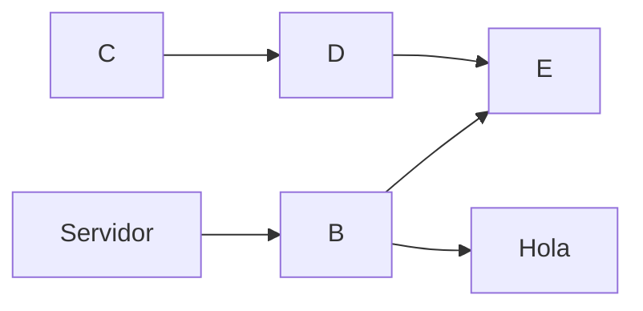

<!--

This page represents the landing page for "titulos" section. It is also shown under the homepage header for "titulos". It should be therefore relatively short and sweet.

\-->

## Markdown Básico
### Títulos

Para establercer los títulos usaré la siguiente

```
# título1
## título2
### título3
#### título4
##### título5
###### título6
```
Y se verá

# título1
## título2
### título3
#### título4
##### título5
###### título6

----
### Negrita y formato
Para ver el texto en negrita escribo
```
***Texto en negrita***
```
Y se verí a así

***Texto en negrita***
### Ver un video
.

## Markdown de Gráficos

### Gráfico con mermaid


    
## Markdown extendido

Hay varias extensiones que puedes usar en markdown las cuales te dejan hacer cosas como las que voy a poner, como este sitio no es compatible solamente pondré el código

1. Diagrama de flujo:
    ```mermaid
    graph TD
        Inicio --> Decisión{Continuar?}
        Decisión -->|Sí| Acción[Seguir]
        Decisión -->|No| Fin[Terminar]
    ```

2. Ecuación:
   $$
   E = mc^2
   $$

3. Tabla:
```
| Fase       | Inicio     | Fin       |
|------------|------------|-----------|
| Planificar | 2024-01-01 | 2024-01-15 |
| Ejecutar   | 2024-01-16 | 2024-02-01 |
 ```

4. Gráfico interactivo:
    ```html
    <div id="chart"></div>
    <script>
        // Código D3.js aquí
    </script>
    ```


